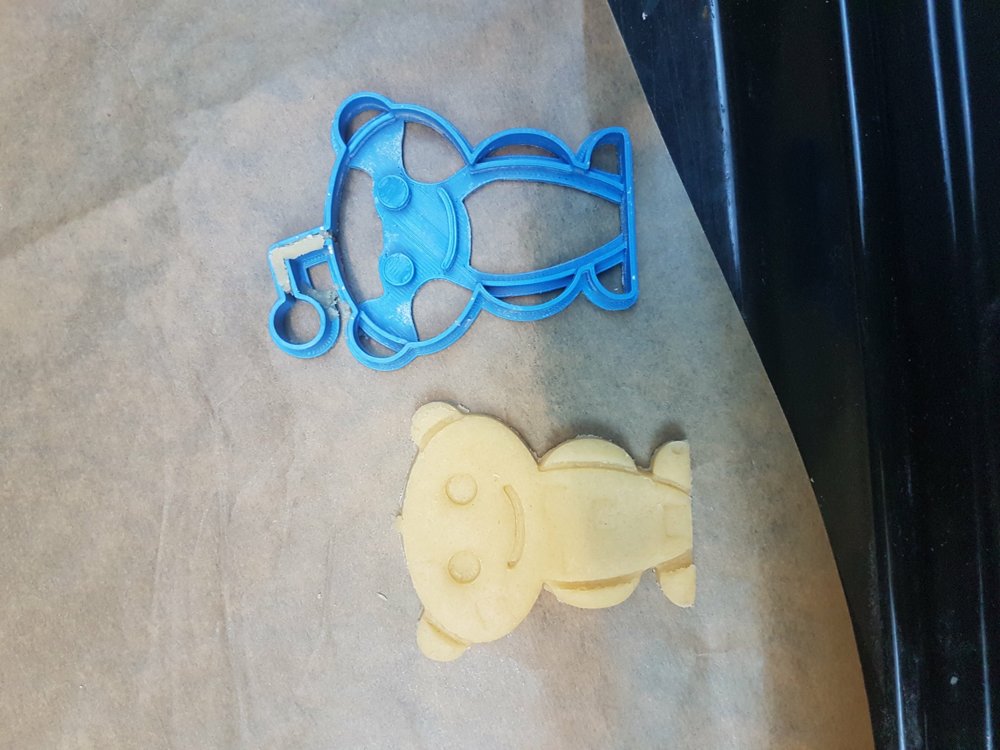
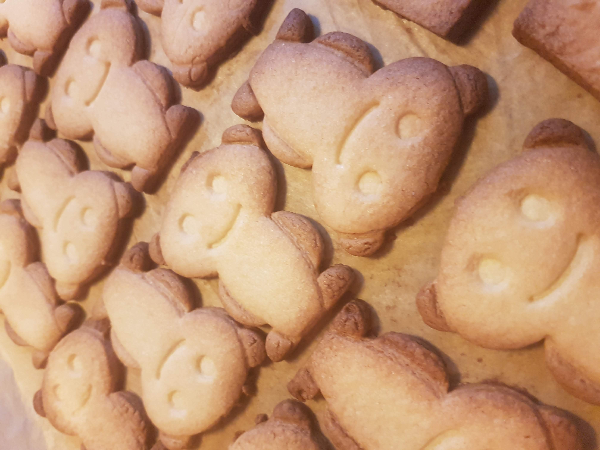

# Reddit Snoo Cookie cutter
Designed for my secret santa giftee in 2019.
Here you can find the source files of my cookie cutter design. 
It is made with Inkscape and FreeCAD.

## Recipe:
* 200 gram sugar
* 200 gram butter
* 1 egg
* 400 gram flour

1. Mix all ingredients for 7 minutes.
2. Knead into a ball.
3. Put into the fridge for 2 hours
4. Roll the dough flat and cut into shapes
5. Bake in the oven at 180°c
6. For 8-20 minutes depending on the thickness

